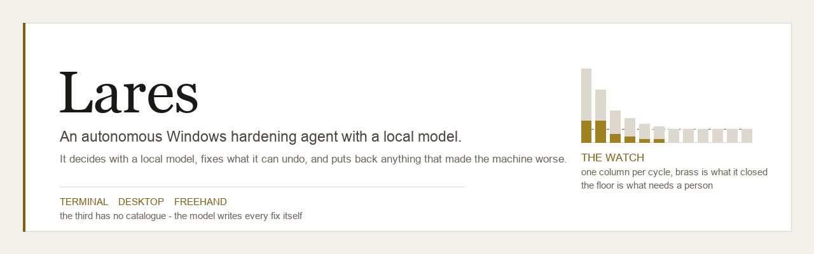
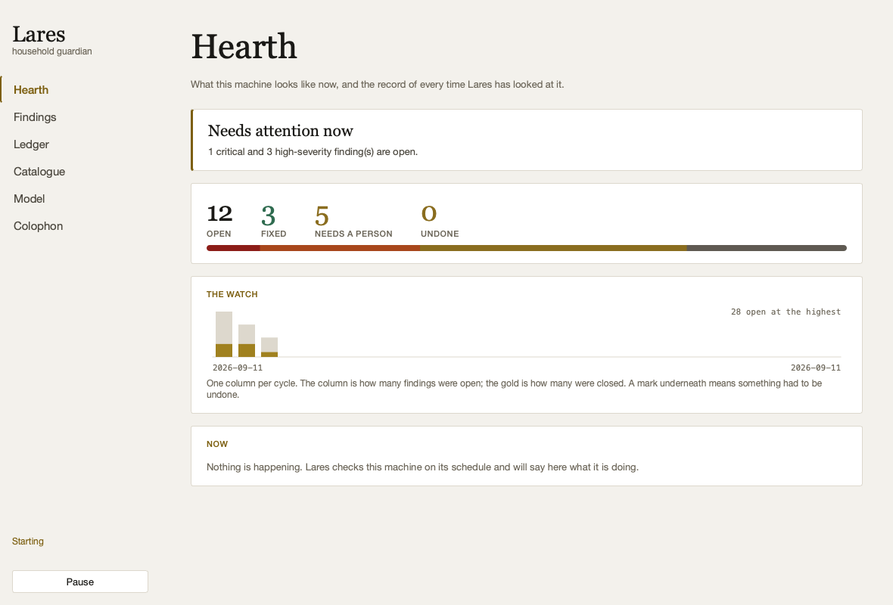
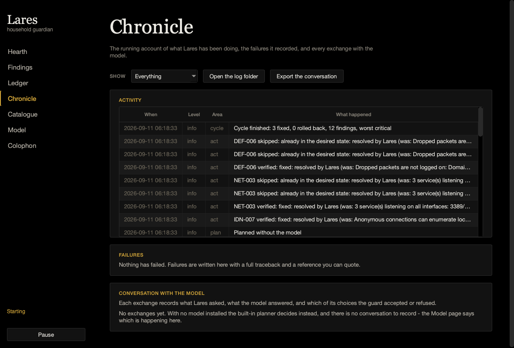

<div align="center">



**An autonomous Windows hardening agent with a language model running on the machine itself.**

It looks at what the machine is, decides what to do about it, fixes what it can
undo, verifies that the fix worked, and puts back anything that made things
worse. No prompts, no dialogs, no cloud, no account.

[Install](#install) · [Two applications](#two-applications) ·
[How it decides](#how-it-decides) · [Why you can leave it running](#why-you-can-leave-it-running) ·
[What it writes down](#what-it-writes-down) · [The model](#the-model) ·
[Will it run here?](#will-it-run-on-my-machine) · [What it will not do](#what-it-will-not-do)

</div>

---

In Roman religion the **Lares** were household guardians: minor gods with no
temples and no mythology to speak of, whose entire remit was the safety of one
house and the people in it. A shrine to them stood by the hearth in ordinary
homes. It seemed the right name for something that lives on one machine, watches
it constantly, and is not interested in anything else.

## The problem this solves

Windows hardening advice exists in enormous quantity and almost nobody applies
it. The CIS benchmark for Windows 11 runs to several hundred pages. The reader
has to work out which items apply to their machine, what each one will break, how
to undo it, and then do the whole thing again in six months. So the firewall
stays off after that one game needed it, WDigest keeps caching passwords in
memory because an installer set it in 2016, and a service runs from
`C:\Tools\Backup Agent\` with no quotes around the path.

Lares does the reading, decides what applies to *this* machine, applies what it
can undo, and keeps a record of every change so any of it can be put back.

## Install

**One file. No Python, no pip, no compiler.**

Download it, run it. The executables are self-contained and the large one has the
language model inside it, so it works on a machine that has never been online.

| Download | What it is | Size |
|---|---|---|
| **`lares-full-x64.exe`** | Terminal application **with the model embedded**. Nothing to fetch, ever. | ~1.1 GB |
| `lares-x64.exe` | Terminal application. Fetches a model the first time it wants one. | ~45 MB |
| `lares-desktop-x64.exe` | Desktop application. | ~90 MB |
| `lares-arm64.exe` · `lares-desktop-arm64.exe` | Windows on ARM. See [below](#will-it-run-on-my-machine). | ~45 / 90 MB |

Get them from the [latest release](https://github.com/at0m-b0mb/Lares-Windows/releases/latest).
Every file is listed in `SHA256SUMS.txt`; check yours before running it.

Or let the installer pick the right one, verify it, and put it on your PATH:

```powershell
irm https://raw.githubusercontent.com/at0m-b0mb/Lares-Windows/main/install.ps1 | iex
```

That is a script from the internet piped into a shell, which is a thing you
should be suspicious of — a security tool asking you to do it without comment
would be a poor advertisement for itself. Read it first:

```powershell
irm https://raw.githubusercontent.com/at0m-b0mb/Lares-Windows/main/install.ps1 -OutFile install.ps1
notepad install.ps1
.\install.ps1 -Full -Desktop -StartWithWindows
```

<details>
<summary>From source instead</summary>

```bash
git clone https://github.com/at0m-b0mb/Lares-Windows
cd Lares-Windows
pip install -r requirements-gui.txt      # or requirements.txt for terminal only
python lares.py doctor
```

macOS and Linux run everything in demo mode against a synthetic machine, which is
how the interface is developed and screenshotted.

</details>

**First run, in this order.** `doctor` says whether this machine can run it,
`scan` changes nothing, `plan` shows you what it *would* do and why. Only then
`run`.

```powershell
lares doctor
lares scan
lares plan
lares run
```

Double-clicking `lares.exe` in Explorer opens a menu instead of flashing a usage
message at you and closing.

## Two applications

Same engine, two front doors. Neither needs the other.

| | |
|---|---|
| **`lares.exe`** | Terminal. Uses colour when `rich` is available and plain text when it is not, because a machine with nothing installed is exactly the machine that most needs hardening. `lares watch` is the agent with no window. |
| **`lares-desktop.exe`** | Desktop. Starts working the moment it opens and keeps working whether you look at it or not. |

<div align="center">



</div>

## How it decides

**The model chooses from a catalogue. It never writes the code that runs.**

This is the whole design. Every remediation is a hand-written, reviewed entry in
`lares/catalog/controls/*.yaml`, carrying a detection probe, a fix, a rollback,
a risk tier, and a paragraph in plain English explaining why it matters. The
model reads the scan and the retrieved catalogue pages and decides *which*
controls to apply, in what order, with what parameters — and then everything it
said is put through validation before anything runs.

```
sense    run every control's probe, gather machine context
think    retrieve the relevant catalogue pages, ask the model to choose
guard    validate parameters, screen the rendered script, check policy
act      snapshot → apply → verify → health check → keep or undo
record   journal the outcome, including refusals
judge    update the circuit breaker
```

A 1.5B model on a slow CPU will sometimes be wrong. It cannot be wrong in a way
that matters, because the worst it can do is name a control that exists and
supply parameters that get rejected.

## Why you can leave it running

You asked for no confirmation dialogs. So the safety is not a prompt — it is that
every change is measured, and undone on the spot if it did not work.

- **Verified, not assumed.** After applying a fix, the same probe that found the
  problem is run again. If the problem is still there, the change is reverted.
- **Health-checked.** Name resolution, the default gateway, an enabled
  administrator account, RDP and WinRM listeners are read before and after. If
  something that was working stops working, the change goes back immediately.
- **Snapshotted.** Registry keys, firewall rules and service configuration are
  exported before the script that touches them runs.
- **Journalled.** Every outcome is appended to a log that carries the fully
  rendered rollback script, so a change can be undone months later without the
  model, the catalogue, or the original finding.
- **Rate-limited.** A budget per cycle, so one bad scan cannot rewrite a machine
  in a single pass.
- **Circuit-broken.** Two consecutive bad cycles and autonomy halts. It keeps
  scanning and reporting, and waits for a person.

A rollback that itself fails is recorded as a failure, not as a rollback — the
change is still on the machine, it says so, and it stays in the undo list.

## What it writes down

Three records, kept apart because they answer three different questions.

| | |
|---|---|
| **Journal** | What was *changed*, and how to undo it. The legal record; never mixed with diagnostics. |
| **Activity log** | What *happened*, in order. Cycles, probes, the breaker. Plain text for reading, JSON lines for machines. |
| **Transcript** | What was *said to the model, what it said back, and what was then done with it*. |

That third one is the one worth having. Anyone can log a prompt and a completion.
In a tool that acts on the answer, what matters is whether the answer was used —
so each exchange records which of the model's choices the guard accepted and
which it refused, and why. An entry showing six proposed actions and five
refusals is the most informative thing this application produces.

Every failure also gets its own report file with the full traceback and a
description of the machine at the time, keyed by a short id that is shown in the
interface. `failed (LR-4F2A91)` is something you can look up.

```powershell
lares logs                        # the running account
lares errors --show LR-4F2A91     # one failure, in full
lares transcript -v               # prompts, replies, and what survived
lares journal                     # what was actually changed
lares undo --last 1               # put it back
```

In the desktop application this is the **Chronicle** page.

<div align="center">



</div>

## The model

**Qwen2.5-Coder**, GGUF at Q4\_K\_M, on the CPU via llama.cpp. No API key, no
network, no telemetry — the model is a file on disk and inference happens in the
process. A security tool that ships a machine's configuration to somebody else's
server to decide what to do about it is not a security tool.

The job is not recalling security trivia; the facts come from the catalogue
through retrieval, which is far more reliable than anything a small model
remembers. The job is reading a scan, choosing controls, filling in parameters,
and emitting strictly-shaped JSON without drifting. That is a code-shaped task,
and Qwen2.5-Coder is the strongest open family at this size.

| Tier | Size | Needs | Speed on a 4-core CPU |
|---|---|---|---|
| 7B | 4.7 GB | 16 GB RAM | 3–6 tokens/s |
| **3B** | 2.0 GB | 8 GB RAM | 6–12 tokens/s — the default |
| 1.5B | 1.1 GB | 4 GB RAM | 10–20 tokens/s — embedded in `lares-full-x64.exe` |
| 0.5B | 0.4 GB | 2 GB RAM | 20–40 tokens/s |

The tier is chosen from measured RAM and physical cores. In the single-file
build, the model is appended to the executable behind a 64-byte footer and
unpacked once into `%LOCALAPPDATA%\Lares\models` with its SHA-256 verified —
so the file is genuinely self-contained but does not re-extract a gigabyte on
every launch.

**There is always a planner.** If no model is installed, is too big for the
machine, or fails to load, the deterministic built-in planner runs instead: it
sorts by severity, prefers the cheapest reversible fix, respects dependencies,
and stops at the budget. The machine still gets hardened. It just does not get
explained as well.

`training/` builds an instruction set from the catalogue and fine-tunes a LoRA
on it, with an evaluation harness that scores a model on whether its plans are
parseable, real, accepted by the guard, faithful to the probe, and complete.

## Will it run on my machine?

Ask it: `lares doctor` reports what is present, what is missing, and what to do
about each.

| | x64 | ARM64 *(incl. VMware Fusion on Apple Silicon)* |
|---|---|---|
| Scanner, catalogue, executor, rollback | yes | yes |
| Terminal application | yes | yes |
| Desktop application | yes | yes — PyQt6 ships ARM64 wheels |
| Embedded language model | yes | **no** |
| Built-in planner | yes | yes |

On **Windows 11 ARM64** everything runs natively except the model backend:
`llama-cpp-python` publishes no ARM64 wheel, so it needs a compiler or it is
simply left out. The built-in planner is the product there, and the application
says so rather than pretending. If you want the model too, install Visual Studio
Build Tools with the ARM64 C++ workload and `pip install llama-cpp-python`.

Windows on ARM will also happily run x64 Python under emulation, which works and
is slower; `doctor` detects that case with `IsWow64Process2` and reports it
separately rather than mistaking it for a real x64 machine.

**In a VM, take a snapshot before the first run with changes enabled.** It is the
cheapest possible undo and covers the cases the rollback journal cannot, such as
a change that needs a restart to reveal its effect.

## What it will not do

- Run any script the model wrote. The Expert lane (`lares ask`) has the model
  author PowerShell freely, runs it past a static screen, prints it, and stops.
  Executing it is your decision and your keystroke.
- Apply anything in the **intrusive** tier without a person. Renaming the
  built-in Administrator, disabling RDP, starting BitLocker — a health check
  cannot tell the difference between "the remote operator is fine" and "the
  remote operator is locked out and cannot tell us".
- Format a volume, clear a disk, delete shadow copies, edit the boot
  configuration, disable a network adapter, turn off Defender, delete a user,
  reboot, or pipe a download into `Invoke-Expression`. These are refused in the
  catalogue and in the Expert lane, by pattern, before anything runs.
- Delete a stored credential and claim it can put it back. `IDN-004` clears a
  clear-text autologon password and is marked irreversible, because keeping a
  copy of a password in order to restore it is not something this will do.
- Tell you your machine is secure. The best verdict is *nothing outstanding*,
  which means thirty specific checks passed.

## Status, stated plainly

**v0.1.2. The engine is tested; the PowerShell is not.**

The Python — the guard, the executor's state machine, the planner, the catalogue
loader, the logging, the theme — is covered by **339 tests** that run on Windows
and Linux across Python 3.10 and 3.12 in CI. That part works.

What has **not** happened is any of the thirty controls executing against a live
Windows machine. Every probe and remediation was written against Microsoft's
documentation and reviewed by hand, and every one is exercised in demo mode,
which fakes the PowerShell round trip. The shapes are right and the logic around
them is right, but a cmdlet that behaves differently on Windows 11 24H2 than the
documentation says would not have been caught yet.

Treat this release as ready to try on a machine you can afford to restore. Start
with `lares scan`, read `lares plan`, and use `--dry-run` if you want the whole
cycle with nothing changed. Findings from real hardware are the most useful thing
anyone could contribute.

## The catalogue

Thirty controls across five domains, each with a probe, a fix, a rollback and a
paragraph of prose. `lares controls` browses them; `lares controls --show NET-003`
prints one in full.

| Domain | Covers |
|---|---|
| `network` | Firewall profiles and default actions, exposed listeners, SMBv1, LLMNR, Remote Registry |
| `identity` | UAC, Guest, clear-text autologon passwords, WDigest, LSA protection, anonymous enumeration |
| `defence` | Defender real-time protection and signatures, tamper protection, ASR rules, SmartScreen, BitLocker, firewall logging |
| `services` | Unquoted service paths, service binaries in writable directories, Print Spooler, WinRM |
| `system` | PowerShell v2, script-block logging, command-line auditing, AutoRun, Windows Update |

The catalogue is the trust boundary, so it is validated hard at load: every
control needs a detect probe; anything with a remediation needs a rollback unless
it declares why not; every `{placeholder}` must be a declared parameter and every
declared parameter must be used; string and path parameters must declare a regex,
because an unconstrained one is a command-injection slot; and an unrecognised key
is a loud failure rather than a silently dropped safety property.

## Tests

```bash
python -m pytest tests/ -q
```

339 tests, none of which need Windows. They cover the guard against injection
payloads in every parameter slot, the executor's full state machine including
rollbacks that themselves fail, the planner against the shapes a quantised model
actually produces, state files that survive being interrupted, the model overlay
including corrupted and truncated payloads, and every text pairing in both themes
against WCAG AA.

## Development notes

```bash
python tools/capture.py          # render every page in both themes
python tools/make_banner.py      # regenerate the banner
python training/build_dataset.py # build the instruction set from the catalogue
python training/evaluate.py      # score a model's planning against the judge
```

The Windows executables are built by CI on `windows-latest` and `windows-11-arm`,
because PyInstaller is a bundler rather than a cross-compiler — a Windows binary
has to be produced on Windows, and an ARM64 one on ARM64.

## Licence

MIT. See [LICENSE](LICENSE).

---

<div align="center">
<sub>Set in Spectral and Inter. The gold is a deep brass that stays readable as
small text, not a bright fill. Dark mode is true black.</sub>
</div>
