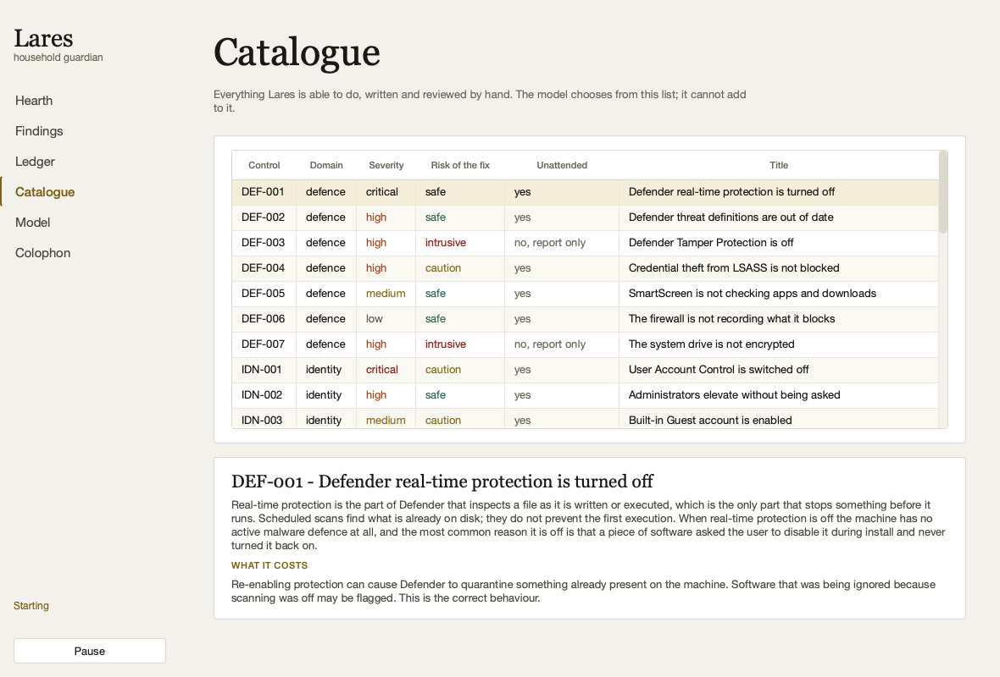

<div align="center">


**An autonomous Windows hardening agent with a language model running on the machine itself.**

It looks at what the machine is, decides what to do about it, fixes what it can
undo, verifies that the fix worked, and puts back anything that made things
worse. No prompts, no dialogs, no cloud.

[Two applications](#two-applications) · [How it decides](#how-it-decides) ·
[Why you can leave it running](#why-you-can-leave-it-running) ·
[The model](#the-model) · [What it will not do](#what-it-will-not-do)

</div>

---

In Roman religion the **Lares** were household guardians: minor gods with no
temples and no mythology to speak of, whose entire remit was the safety of one
house and the people in it. A shrine to them stood by the hearth in ordinary
homes. It seemed the right name for something that lives on one machine, watches
it constantly, and is not interested in anything else.

## The problem this solves

Windows hardening advice exists in enormous quantity and almost nobody applies
it. The CIS benchmark for Windows 11 is several hundred pages. The reader has to
work out which items apply to their machine, what each one will break, how to
undo it, and then do it again in six months. So the firewall stays off after that
one game needed it, WDigest keeps caching passwords in memory because some
installer set it in 2016, and a service runs from `C:\Tools\Backup Agent\` with
no quotes around the path.

Lares does the reading, decides what applies to *this* machine, applies what is
safe, and keeps a record of every change so any of it can be put back.

## Two applications

Same engine, two front doors. Neither needs the other.

```bash
python lares.py run              # one cycle: look, decide, fix, verify
python lares.py watch            # the headless agent, on a schedule
python lares-gui.py              # the desktop application
```

| | |
|---|---|
| **`lares.py`** | Terminal. Uses `rich` when it is installed and plain `print` when it is not, because a machine with a bare Python install is exactly the machine that most needs hardening. `watch` is the agent with no window. |
| **`lares-gui.py`** | Desktop. Starts working the moment it opens and keeps working whether you look at it or not. |

<div align="center">


</div>

## How it decides

The model is not allowed to write the code that runs on your machine. It
**chooses** from a catalogue of thirty controls, each one written and reviewed by
hand, each carrying a detection probe, a remediation, a rollback, and a plain
statement of what it costs you.

```
sense    run every control's probe          ->  facts + findings
think    retrieve the relevant controls,
         ask the model which to apply        ->  a plan
act      for each, through the guard         ->  outcomes
record   journal everything, including
         the refusals                        ->  a history you can undo from
```

That division is the whole design. The model contributes judgement — which fix
matters most on a laptop that lives on public Wi-Fi, whether to bother with the
audit policy before the firewall is on — and the catalogue contributes the part
that has to be correct. A model that hallucinates can pick the wrong control. It
cannot invent one.

**Detection and verification are the same probe.** After a change, Lares re-runs
the exact code that found the problem. There is no second implementation to
drift out of step with the first.

## Why you can leave it running

You asked for no confirmation dialogs, so the safety cannot live in a prompt. It
lives in the executor, and every single change goes through all of this:

| | |
|---|---|
| **validate** | The model's parameters must match the shapes the control declared. Types, ranges, enum membership, regex — and a hard refusal of shell metacharacters no matter how permissive the control's own pattern is. |
| **screen** | The rendered script is read for operations Lares will never perform: formatting a disk, deleting a directory tree, removing a user, deleting shadow copies, editing boot configuration, disabling antivirus, downloading and executing. |
| **probe** | Is it already fixed? Then do nothing. |
| **baseline** | Read seven health signals while the machine is still known good. |
| **snapshot** | Export the registry keys, firewall rules and service configuration the script is about to touch. |
| **apply** | Run it. |
| **verify** | Re-run the probe. Did it actually work? |
| **health** | Re-read the signals. Did anything that worked stop working? |
| **decide** | Keep it, or **put it back, right now**. |

A change survives only if the problem is gone *and* nothing regressed. Anything
else is rolled back on the spot, with no human involved — there is nobody to
ask at three in the morning.

Above that sit three more limits:

- **A change budget per cycle**, so one bad scan cannot rewrite the machine in a
  single pass. A backlog drains over several cycles with a verification between
  each.
- **Two rollbacks inside one cycle stops that cycle.** If two changes had to be
  undone, this machine does not behave the way the catalogue expects, and
  working through the remaining eight actions to find that out is not wisdom.
- **A circuit breaker.** After consecutive bad cycles, Lares stops changing
  anything and keeps reporting until a person types `lares reset`.

Health signals are compared against a **baseline**, not against an absolute. A
laptop that was already offline before the change is not a regression Lares
caused, and reporting it as one would make every cycle on a disconnected machine
look like a catastrophe.

## The model

Embedded, quantised, on the CPU, with no network involved. A security tool that
uploads your machine's configuration to somebody else's computer in order to
decide what to do about it is not a security tool.

The tier is chosen from measured RAM and physical core count:

| | Model | Size | Needs | Roughly |
|---|---|---|---|---|
| `7b` | Qwen2.5-Coder 7B Instruct | 4.7 GB | 16 GB RAM, 6 cores | 3-6 tok/s |
| `3b` | Qwen2.5-Coder 3B Instruct | 2.0 GB | 8 GB RAM, 4 cores | 6-12 tok/s |
| `1.5b` | Qwen2.5-Coder 1.5B Instruct | 1.1 GB | 4 GB RAM, 2 cores | 10-20 tok/s |
| `0.5b` | Qwen2.5-Coder 0.5B Instruct | 0.4 GB | anything | 20-40 tok/s |

All Q4_K_M GGUF through `llama.cpp`. `python lares.py model` measures your
machine and tells you which it picked and why.

**Qwen2.5-Coder rather than a security-tuned model**, because the job is not
recalling security trivia — it is reading a scan, choosing controls, filling in
parameters and emitting strict JSON without drifting. That is a code-shaped task,
and Qwen2.5-Coder is the strongest open family at these sizes. The security facts
come from BM25 retrieval over the catalogue's own rationales, which is far more
reliable than anything a 3B model remembers.

**The model is optional.** If it is missing, too large for the machine, or
inference fails, the built-in planner takes over: sort by severity, prefer the
cheapest reversible fix, respect dependencies, stop at the budget. It is not a
stub. An install that never downloads a model still hardens the machine
correctly; it just cannot explain itself in your own terms.

And the model's plan is a **prioritisation, not a veto**. A finding it neither
planned nor explicitly deferred gets appended by the built-in planner, because a
1.5B model that stops generating mid-list is having a generation artefact, not
making a decision, and a security tool must not lose a critical fix to one.

Training your own adapter is documented honestly in
[`training/README.md`](training/README.md), including the part where the right
answer might be not to.

## What it will not do

This is the half that matters.

**It will never tell you the machine is secure.** The best verdict it gives is
"nothing outstanding", which means the thirty things it checks are in the state
it wanted. There are settings it does not look at, software it cannot see inside,
and whole categories of attack no configuration check would catch.

**Seven controls it finds but deliberately will not fix**, because the
consequences are not measurable by a health check:

| | Why a person decides |
|---|---|
| Disk not encrypted | Needs a recovery key stored somewhere safe, may need firmware changes, and loses the machine if the key is lost. |
| Tamper Protection off | Cannot be enabled by a script *by design* — if a program could switch it on, a program could switch it off. It is a switch in the Windows Security app. |
| Too many local administrators | Which administrator is surplus is a judgement about how the machine is used. Getting it wrong locks someone out of their own computer. |
| Service binary in a writable folder | Tightening the folder may break the application, which sometimes legitimately writes there. |
| Privileged scheduled task from a writable path | Either a badly packaged application or somebody's foothold, and Lares cannot tell which. |
| Security updates 45+ days behind | Reboots the machine, occasionally breaks a driver. An unattended loop does not get to decide when your machine restarts. |
| Clear-text password in the registry | Removing automatic logon can lock the owner out of a kiosk or media box nobody has typed the password into for two years. |

Each is reported with the catalogue's own reasoning, in the terminal under
**Needs a person** and in the desktop application under **Findings**.

## Installing

Windows is the target. macOS and Linux run everything in demo mode against a
synthetic machine, which is how it is developed and screenshotted.

```bash
git clone https://github.com/at0m-b0mb/Lares-Windows
cd Lares-Windows
pip install -r requirements.txt          # PyYAML, and rich if you want colour
pip install -r requirements-gui.txt      # PyQt6, for the desktop application
pip install llama-cpp-python             # for the model; optional

python lares.py --demo scan              # try it against the synthetic machine
python lares.py model --download         # fetch the model for your hardware
python lares.py run                      # the real thing
```

Remediation needs an elevated process. Lares says so plainly rather than failing
every fix with an access-denied, and a non-elevated run is a perfectly good
read-only mode.

### Commands

| | |
|---|---|
| `scan` | Look and report. Changes nothing. `--report out.html` |
| `plan` | Show what it would do and why, without doing it. |
| `run` | One cycle. `--dry-run` to decide everything and change nothing. |
| `watch` | Cycles on a schedule until stopped. |
| `journal` | Every change, newest first. |
| `undo` | Put a change back. `--last 3`, or an action id. |
| `controls` | Browse the catalogue. `--show NET-003` for one in full. |
| `model` | Which model, why that one, and `--download`. |
| `ask` | The Expert lane — the model writes a script, screened and printed, never run. |
| `reset` | Re-arm autonomy after the breaker halted it. |
| `config` | `--set ceiling=safe --set budget=5` |

## The catalogue

Thirty controls across five domains. Twenty-three can run unattended; the rest
need a person, and say so.

| Domain | What it covers |
|---|---|
| `network` | Firewall profiles and default actions, listeners on every interface, SMBv1, LLMNR poisoning, Remote Registry |
| `identity` | UAC, silent elevation, Guest, stored credentials, WDigest, LSA protection, anonymous enumeration |
| `defence` | Defender real-time protection and signatures, Tamper Protection, the LSASS credential-theft ASR rule, SmartScreen, firewall logging, BitLocker |
| `services` | Unquoted service paths, writable service directories, Point and Print driver installation, privileged scheduled tasks |
| `system` | The PowerShell 2.0 engine, script block logging, command-line auditing, AutoRun, patch currency |

Adding one is a YAML file. The loader refuses a catalogue that is not fit to
execute from: a remediation with no rollback, an undeclared placeholder, an
unconstrained string parameter, a `choices: [Off, Warn]` that YAML quietly turned
into a boolean, an unrecognised key that would have silently dropped a safety
property.

<div align="center">



</div>

## Tests

```bash
python -m pytest tests/ -q      # 251 assertions
```

The two that earn their keep:

**The guard** is tested against inputs a model would never produce but an
attacker would — injection payloads in every parameter slot, type confusion,
values just outside their declared range — plus the awkward cases that are
legitimate and must still pass, like `C:\Program Files (x86)\`.

**The theme** checks every text pairing against WCAG AA in both themes. That is
not ceremony: it caught four real failures, including a brass unreadable on its
own background and a blue-grey that had drifted into a palette specified as
warm.

## Development notes

Three bugs worth recording, because each was found by running the thing rather
than by reading it:

- `render()` used `str.format`, which parses PowerShell's own `{ }` script blocks
  as replacement fields. Every rollback with an `if` in it failed to render.
- `Severity` subclasses `str` so it serialises cleanly, which means it inherits
  `str`'s comparison operators. Overriding only `__lt__` left `>` falling through
  to alphabetical comparison, where `"high" < "medium"`. Every report understated
  the worst finding on the machine.
- A font declared in a Qt stylesheet beats `setFont()`, which had silently
  flattened every serif heading in the desktop application back to the body face.

## Licence

MIT. See [LICENSE](LICENSE).

---

<div align="center">
<sub>

Built by [at0m-b0mb](https://github.com/at0m-b0mb).
Headings in Georgia, interface in Segoe UI, evidence in Consolas.
The accent is a deep brass, dark enough to be read as small text on paper;
a second, brighter gold marks the things that carry no words.

</sub>
</div>
